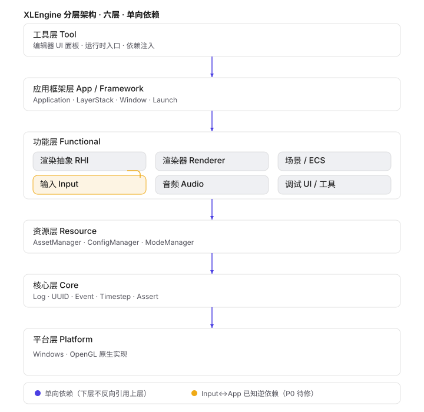

# XLEngine

Integrating what I've learned

only support platform Windows

OpenGL 4.5

## 架构层级（Architecture Layers）

XLEngine 采用 **GAMES104 六层模型**（自上而下单向依赖）：
`工具层 → 应用框架层 → 功能层 → 资源层 → 核心层 → 平台层`。
即在 GAMES104 五层基础上**拆分出应用框架层**（存放 `Application`/`Layer`/`LayerStack`/`Window`/`Launch` 等装配逻辑）。
**上层只能依赖下层，下层绝不能反向引用上层单例**（如 Renderer/Input 不得依赖 Application）。下表随功能增删同步维护。



### 六层模型

> 图中用 6 个主框表示 6 层。功能层内部再细分为 RHI / 渲染器 / 场景ECS / 输入 / 音频 / 调试 UI 六个子系统（见「功能层子系统」），子系统不额外计层。

| 层级                      | 关注点  | 职责                                   | 主要目录                                                                                                                      | 对应类                                                                                                                                                                                                                                                                                                                                                                                                      |
| ----------------------- | ---- | ------------------------------------ | ------------------------------------------------------------------------------------------------------------------------- | -------------------------------------------------------------------------------------------------------------------------------------------------------------------------------------------------------------------------------------------------------------------------------------------------------------------------------------------------------------------------------------------------------- |
| **工具层 Tool**            | 编辑器  | 编辑器 UI 面板、运行时入口与依赖注入                 | `Editor/`                                                                                                                 | `EditorLayer`、`SceneHierarchyPanel`、`ContentBrowserPanel`、`XLengineEditorApp`（`MyAppInitialize` 注入 ImGuiLayer/PushOverlay）                                                                                                                                                                                                                                                                               |
| **应用框架层 App/Framework** | 装配   | 把功能层组装为可运行程序：窗口生命周期、层栈调度、主循环         | `Runtime/Core/AppFramework`、`Runtime/Core/Layer`、`Runtime/Core/Window.h`、`Runtime/Launch`                                 | `Application`、`Layer`、`LayerStack`、`Window`、`Launch`                                                                                                                                                                                                                                                                                                                                                     |
| **功能层 Functional**      | 能力   | 具体业务能力：渲染、场景/ECS、输入、音频、调试 UI         | `Runtime/Renderer`、`Runtime/EcsFramework`、`Runtime/ImGui`、`Runtime/Input`、`Runtime/Audio`、`Runtime/Scene`、`Runtime/Debug` | `Renderer3D`、`Renderer2D`、`EditorCamera`、`SceneCamera`、`TextRenderer`、`ParticleSystem`、`StaticMesh`、`Model`、`Registry`、`Entity`、`Level`、`GameSystem`、`RenderSystem2D`、`PhysicSystem2D`、`NativeScriptSystem`、`SceneSerializer`、`SceneCamera`、`Input`、`InputAction`、`AudioSystem`、`ImGuiLayer`、`Instrumentor`（含贯穿的 RHI 抽象 `RendererAPI`、`RenderCommand`、`VertexBuffer`、`Shader`、`Texture`、`Framebuffer` 等） |
| **资源层 Resource**        | 资产   | 资源注册/加载、配置、运行模式                      | `Runtime/Resource`                                                                                                        | `AssetManager`、`ConfigManager`、`ModeManager`                                                                                                                                                                                                                                                                                                                                                             |
| **核心层 Core**            | 基础设施 | 无依赖的通用设施、抽象类型                        | `Runtime/Core/Base`、`Runtime/Core/Log`、`Runtime/Core/Timestep.h`、`Runtime/Core/UUID.*`、`Runtime/Events`                   | `Log`、`Timestep`、`UUID`、`PublicSingleton`、`Assert`、`Event`、`KeyEvent`、`MouseEvent`、`ApplicationEvent`                                                                                                                                                                                                                                                                                                    |
| **平台层 Platform**        | 原生   | OS / 图形 API 的原生封装（RHI 具体实现，如 OpenGL） | `Runtime/Platform/Windows`、`Runtime/Platform/OpenGL`                                                                      | `WindowsWindow`、`WindowsInput`、`WindowsPlatformUtils`、`OpenGLContext`、`OpenGLShader`、`OpenGLTexture`、`OpenGLVertexArray`、`OpenGLVertexBuffer`、`OpenGLIndexBuffer`、`OpenGLFramebuffer`、`OpenGLRendererAPI`                                                                                                                                                                                                |

### 功能层子系统（Functional）

| 子系统              | 职责                                  | 主要目录                                   | 对应类                                                                                                                              |
| ---------------- | ----------------------------------- | -------------------------------------- | -------------------------------------------------------------------------------------------------------------------------------- |
| **渲染抽象 RHI**     | 图形资源/API 的跨实现抽象（抽象在上、OpenGL 实现在平台层） | `Runtime/Renderer`（头）                  | `RendererAPI`、`RenderCommand`、`VertexBuffer`、`IndexBuffer`、`VertexArray`、`Shader`、`Texture`、`Framebuffer`、`GraphicsContext`      |
| **渲染器 Renderer** | 场景/精灵/文本/粒子绘制、编辑器相机                 | `Runtime/Renderer`                     | `Renderer3D`、`Renderer2D`、`EditorCamera`、`Camera`、`SceneCamera`、`TextRenderer`、`ParticleSystem`、`StaticMesh`、`Model`             |
| **场景/ECS**       | 实体-组件-系统、关卡、序列化                     | `Runtime/EcsFramework`、`Runtime/Scene` | `Registry`、`Entity`、`Level`、`GameSystem`、`RenderSystem2D`、`PhysicSystem2D`、`NativeScriptSystem`、`SceneSerializer`、各 `*Component` |
| **输入 Input**     | 按键/鼠标/动作捕获                          | `Runtime/Input`                        | `Input`、`InputAction`、`KeyCodes`、`MouseCodes`                                                                                    |
| **音频 Audio**     | 玩法反馈音效                              | `Runtime/Audio`                        | `AudioSystem`                                                                                                                    |
| **调试 UI / 工具**   | 帧剖析                                 | `Runtime/ImGui`、`Runtime/Debug`        | `ImGuiLayer`、`Instrumentor`                                                                                                      |

### 依赖方向速览（自上而下）

```
工具层 Tool
  ↓ 依赖
应用框架层 App/Framework
  ↓ 依赖
功能层 Functional（含 RHI 抽象，后端由平台层实现）
  ↓ 依赖
资源层 Resource
  ↓ 依赖
核心层 Core（无下游依赖）
  ↓ 依赖
平台层 Platform（OS/图形原生实现）
```

### 已知分层问题（P0-P3 待修）

* `Input`（功能层）当前在 `WindowsInput.cpp`（平台层）反向依赖 `Application` 单例 —— P0 改造为注入 `Window*`。

* `LayerStack`/`Window` 属应用框架层，当前物理目录仍在 `Core/` 下 —— 计划整理到 `Core/AppFramework`（只动目录，不改逻辑）。

* `Renderer/RendererAPI` 接口位于功能层、实现位于平台层，遵循「抽象在上、实现在下」 —— 依赖方向正确，但当前 GraphicsContext 与 Window 耦合待梳理。

* `EditorCamera` 的 Orbit/Fly 输入逻辑与相机本体耦合 —— 计划拆分为独立 `CameraController`。

## 命名规范

### 命名法

统一采用Pascal命名法（文件夹、类名等），第三方库除外

CMakeLists.txt 的变量命名也采用 Pascal 命名法，比如：

```
set(ProjectRootDir "${CMAKE_CURRENT_SOURCE_DIR}")
```

这里变量 ProjectRootDir 采用 Pascal 命名法，与 CMAKE 自带变量区分（比如 CMAKE\_CURRENT\_SOURCE\_DIR ）

### include 头文件顺序

首先include同级文件，其次是同Source文件，再次为第三方依赖（确保依赖顺序）
比如 Editor 中：

```
// 同级文件（同属于 Editor ）
#include "EditorLayer.h"

// 同Source文件（位于 Runtime 中）
#include <XLEngine.h>
#include <Runtime/Core/EntryPoint.h>	

// 第三方依赖
#include <imgui/imgui.h>
#include <glm/gtc/matrix_transform.hpp>
#include <glm/gtc/type_ptr.hpp>
```

### 代码规范

XLEngine 的代码规范偏Unreal，可参考：
<https://docs.unrealengine.com/4.27/zh-CN/ProductionPipelines/DevelopmentSetup/CodingStandard/>

原则：

1. 尽量不使用下划线
2. 如果是类内部成员变量，在前面加小写字母m
3. 如果是bool类型变量，在前面加小写字母b（覆盖上一条，即类内部的bool类型成员变量只需要加b即可）
4. 类内成员统一放在类的最末尾（方法置于前）
5. 临时变量一律小写字母开头

## Getting Started

**1. Downloading the repository**
`git clone git@github.com:Xulin8/XLEngine.git`

**2. You can choose one of the following methods to build XLEngine:**

2.1 Run the Win-GenProjects.bat

2.2 Run the following commands:

```
cd XLEngine
cmake -B build
cmake --build build --parallel 4
```

2.3 Visual Studio: Open Folder, then choose XLEngine folder)

## 编辑器操作（Editor Controls）

### 相机漫游（Roam Mode / FPS）

按 `F` 键，或 **Settings → Camera → Roam mode (FPS)** 勾选，可在场景中自由漫游预览：

| 按键                    | 功能            |
| --------------------- | ------------- |
| `W` / `A` / `S` / `D` | 前后左右移动（沿相机平面） |
| `空格` / `Q`            | 上升 / 下降       |
| 鼠标右键（按住）              | 视角旋转（FPS 式）   |
| `Shift`               | 加速（4 倍）       |
| 滚轮                    | 沿视线方向平移       |
| `F`                   | 退出漫游          |

漫游模式下自动禁用 gizmo 快捷键（`Q/W/E/R`），避免与移动键冲突；退出漫游后恢复 gizmo 操作。输入仅在视口悬停/聚焦时生效，不会误触其他面板。进入/退出漫游时视角无缝衔接。

### 轨道视角（Orbit Mode，默认）

| 按键                  | 功能   |
| ------------------- | ---- |
| `Alt` + 左键（按住）      | 旋转视角 |
| `Alt` + 中键（按住）      | 平移   |
| `Alt` + 右键（按住） / 滚轮 | 缩放   |

### Gizmo 变换

* `W` / `E` / `R`：切换 平移 / 旋转 / 缩放 gizmo

* `Q`：取消 gizmo

* `Ctrl`（按住）：对齐吸附（平移/缩放 0.5，旋转 45°）

### M1 风格化视口

* 默认全屏水墨描边风格化输出

* **Settings → Diagnostic split view**：切换 2x2 诊断分屏（原始场景 / 边缘图 / 法线 / 深度）

* **Settings → Auto day-night cycle**：自动昼夜循环（约 33s 一圈）

## Credits

* hebohang [HEngine](https://github.com/hebohang/HEngine)

* Cherno [Hazel](https://github.com/TheCherno/Hazel)

* BoomingTech [Pilot](https://github.com/BoomingTech/Pilot)

