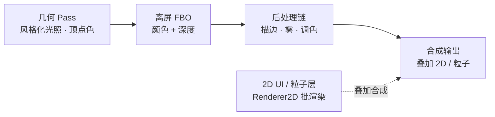

# 《微光岛 LUMEN ISLE》立项文档

> 版本：v0.1（立项初稿）｜日期：2026-08-28｜工作名，可调整

***

## 1. 项目概述

一句话：**一段约 5 分钟、无对白、纯氛围的风格化探索体验——「可玩的渲染技术演示」。**

| 项    | 内容                              |
| ---- | ------------------------------- |
| 类型   | 技术演示向小游戏 / 步行模拟（Walking-sim）    |
| 平台   | Steam PC（Windows 64 位）          |
| 引擎   | 自研 XLEngine（C++20 + OpenGL 4.5） |
| 包体目标 | ≈ 15-25MB（硬约束 ≤ 500MB）          |
| 视觉   | 强 Shader 风格化，素材量趋近 0（全程序化生成）    |

***

## 2. 目标与约束

**做对什么（Go/No-Go 判据）**

* 视觉第一：强 Shader 风格化，一眼惊艳

* 技术力第二：全程序化生成 + 自研光照/后处理管线，包体数字本身就是展示

* 玩法第三：轻交互、重氛围，3-5 分钟一局

**明确不做（边界）**

* 不做大玩法系统（无战斗/装备/成长树）

* 不做多人 / 联机

* 不做长篇内容（单场景单循环）

**硬约束**

* 包体 ≤ 500MB（因素材导致的超标 = 失败）

* 仅 Windows 64 位（XLEngine 现状）

***

## 3. 游戏概念

### 3.1 主题与玩法

* **主题**：在一片程序化生成的风格化小岛上，收集散落的「光尘」，点亮三座灯台。

* **核心循环**：探索 → 收集光尘 → 点亮灯台（×3）→ 触发「黎明时刻」收尾。

* **黎明时刻**：昼夜色调、雾气浓度、描边强度随时间风格化过渡，作为情绪高潮。

* **体验时长**：3-5 分钟一局，完成后可继续自由散步。

* **交互**：移动、交互（收集 / 点亮）、跳过开场说明。

* **叙事**：无对白、无文字叙事，纯视觉与氛围驱动。

### 3.2 场景构成（单场景，程序化生成）

| 元素      | 实现方式                           |
| ------- | ------------------------------ |
| 地形      | CPU 生成网格（simplex 噪声），顶点色渐变，零贴图 |
| 植被 / 岩石 | 程序化散布的低多边形小物件（Box/Sphere 变体）   |
| 云层      | 视差多层半透明云带                      |
| 光尘      | GPU / Renderer2D 粒子，飘浮引导玩家     |
| 灯台 ×3   | 交互点，点亮后触发全局状态变化                |
| 天空 / 昼夜 | Shader 驱动渐变天空 + 方向光角度变化        |

***

## 4. 视觉方向（已锁定 · 2026-08-29）

### 4.1 美术风格定义（已锁定）

| 维度    | 定论                                 |
| ----- | ---------------------------------- |
| 画面质感  | **手绘墨线**（强轮廓描边 + 近黑剪影物件，纸面噪点质感）    |
| 画面形式  | **2.5D 顶/斜视角**（固定机位俯瞰，伪 3D 深度与雾效）  |
| 色彩基调  | **阴暗 · 末世 · 诡异**（深夜压抑 + 黎明微光的两极情绪） |
| 风格参考  | 饥荒 / 阴暗森林 / 动物井 / 挺进地牢             |
| 程序化色板 | 6 色全程序化派生，零贴图素材（见下表）               |

**锁定色板（PALETTE）**

| 色名  | 值       | 用途          |
| --- | ------- | ----------- |
| 墨底  | #17181A | 描边 / 剪影底色   |
| 苔灰绿 | #4A523F | 地形 / 植被主色   |
| 朽褐  | #4A3A2C | 土壤 / 枯木     |
| 惨白  | #C9C8B8 | 雾 / 冷光 / 光尘 |
| 荧绿  | #9DB84A | 诡异生物光（视觉焦点） |
| 余烬橙 | #C96E3A | 火种 / 希望点缀   |

### 4.2 视觉支柱（全部 Shader 实现）

1. **自研 toon 光照管线** —— 手动 lambert + 阶梯量化（3 档）+ 环境光 + 方向光 + 双点光源（荧绿/余烬）+ exp2 指数雾，亮度完全可控（无物理因子干扰）。
2. **墨线描边 + 纸张噪点 + 荧光辉光后处理链** —— 风格化轮廓 + 纸面颗粒 + 毒光泛光，拉开层次。
3. **昼夜循环（深夜末世 → 黎明微光）** —— 环境光 / 方向光强度色温、雾色密度随时间平滑插值。
4. **程序化地形着色** —— 顶点色 + 噪声细节，不依赖任何贴图。
5. **末世视觉证据** —— 墨线剪影树（多变体）+ 人工遗迹残骸（锈蚀金属 / 碎石路基），零额外素材。
6. **光尘粒子 + 视差云层** —— 漂浮引导与氛围点缀。

> 判定：若任意视觉支柱需要引入贴图素材，视为方案跑偏，改用 Shader 数学实现。

***

## 5. 技术方案

### 5.1 引擎现状盘点（已核实）

**已具备**

* EnTT ECS + 组件体系（Transform / Camera / StaticMesh / Sprite / Rigidbody2D / NativeScript 等）

* Level 运行时循环（`OnRuntimeStart` / `OnUpdateRuntime`）+ System 框架

* Renderer2D 批渲染（quad / circle / line）、Texture2D、SubTexture2D

* Shader 抽象（GLSL 文件加载 + ShaderLibrary + 统一 uniform 设置）

* Framebuffer 多附件离屏渲染（RGBA8 + RED\_INTEGER + DEPTH24STENCIL8）

* Box2D 物理、assimp 模型加载、SceneSerializer（yaml）

* 字体资源（OpenSans ×2）

**缺失（= 自研工作量）**

* 3D 光照（方向光 / 环境光）—— Renderer3D 现为占位实现，固定输出红色

* 3D 材质 / 贴图接入

* 后处理管线（全屏四边形 + 多 pass 链）

* 文本渲染 / HUD

* 粒子系统

* 音频

* 独立运行程序（当前仅编辑器 exe）

### 5.2 自研工作清单

**P0 渲染核心（本作命脉）**

| #    | 工作项     | 落地位置                                         | 说明                             |
| ---- | ------- | -------------------------------------------- | ------------------------------ |
| P0-1 | 风格化光照管线 | `Renderer/Renderer3D` + 新 Shader             | 世界法线变换、方向光 + 环境光、toon ramp、rim |
| P0-2 | 后处理管线   | 新增 `Renderer/PostProcessStage`               | FBO 多附件 → 全屏四边形 → 描边 / 雾 / 调色链 |
| P0-3 | 程序化地形   | 新增 `EcsFramework/Component/TerrainComponent` | CPU 生成网格 + 顶点色（simplex noise）  |
| P0-4 | 材质接入 3D | `StaticMeshComponent`                        | 增加材质色字段，替换硬编码红色                |

**P1 可玩性**

| #    | 工作项           | 说明                                                 |
| ---- | ------------- | -------------------------------------------------- |
| P1-1 | 文本渲染 / HUD    | 新增 TextComponent，复用 OpenSans 资源                    |
| P1-2 | 输入动作映射        | 基于 Input 增加「移动 / 交互」抽象                             |
| P1-3 | 粒子系统          | 光尘 / 微风，Renderer2D 或 GPU 粒子                        |
| P1-4 | 音频            | 代码合成环境音 / 叮铃声（零素材）                                 |
| P1-5 | 启用 ECS System | 恢复 Level 中注释的 System 挂载（Physics / Script / Render） |

**P2 发布**

| #    | 工作项           | 说明                             |
| ---- | ------------- | ------------------------------ |
| P2-1 | 独立运行程序        | 最小 runtime 入口（不带 ImGui 编辑器 UI） |
| P2-2 | Steam 打包 + 压缩 | 安装包化 + LZMA 压缩，验证包体预算          |

### 5.3 渲染管线设计

### 5.4 包体预算

| 项           | 大小            | 说明                 |
| ----------- | ------------- | ------------------ |
| 引擎 exe + 依赖 | \~10-20MB     | Release + 静态链接优化   |
| 素材          | 0             | 全程序化 + 代码合成音频      |
| 字体          | \~600KB       | OpenSans ×2        |
| **合计**      | **≈ 15-25MB** | 距 500MB 上限余量 20 倍+ |

***

## 6. 里程碑

| 里程碑                | 内容                                            | 验收标准                                                      |
| ------------------ | --------------------------------------------- | --------------------------------------------------------- |
| **M0 风格预研** ✅      | Three.js + Vite 原型：自定义 toon 光照、墨线描边、纸张噪点、昼夜调色 | **已完成（2026-08-29）**：视觉方向验收通过，深夜 avgL 8.8% / 黎明 14.6%，对比鲜明 |
| **M1 渲染管线（P0）**    | P0-1 \~ P0-4 全部落地                             | 编辑器内可运行「纯视觉演示场景」：程序化地形 + 风格化光照 + 后处理                      |
| **M2 可玩 demo（P1）** | P1-1 \~ P1-5                                  | 完整核心循环可玩：探索 → 收集 → 点亮 → 黎明                                |
| **M3 发布（P2）**      | P2-1 \~ P2-2                                  | 独立 exe + Steam 构建，实测包体 ≤ 25MB                             |

> 每个里程碑完成后本地 git 提交（按功能/模块切分提交，默认不推送）。

***

## 7. 风险与对策

| 风险                     | 等级 | 对策                                  |
| ---------------------- | -- | ----------------------------------- |
| 3D 渲染从占位起步，光照/描边实现不确定性 | 中  | toon/描边/雾均为成熟技术路线，M0 先用 Three.js 验证 |
| 引擎需补文本 / 音频 / 粒子       | 中  | 全部采用最小实现（位图字 / 合成音 / 粒子条带）          |
| Steam 上架流程与审核          | 低  | 按官方指引推进，demo 先行验证                   |
| 范围蔓延                   | 低  | 玩法刻意做小，一切服务于视觉展示                    |

***

## 8. 待确认事项

* [x] M0 预研完成后，视觉方向是否按本文档执行 —— **已锁定（2026-08-29）**：手绘墨线 · 2.5D 顶/斜视角 · 阴暗末世诡异 + 6 色程序化色板

* [ ] 游戏正式命名（暂用「微光岛 LUMEN ISLE」，未定）

* [ ] 是否增加更轻量的收集 / 引导机制

* [ ] 是否需要存档（当前规划：不需要）

